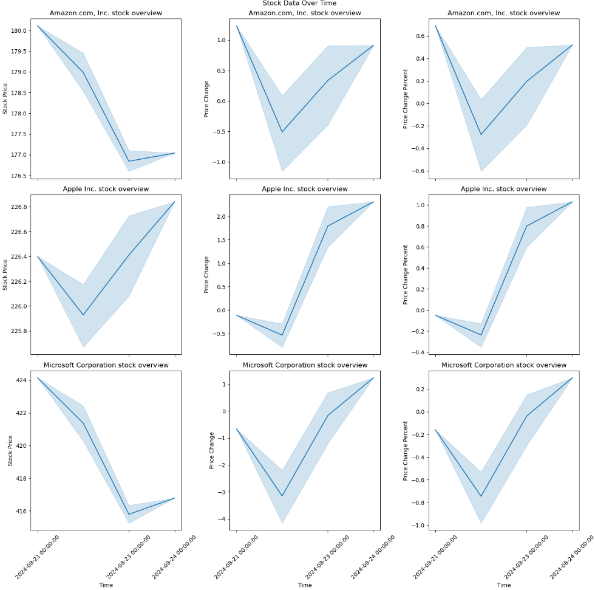
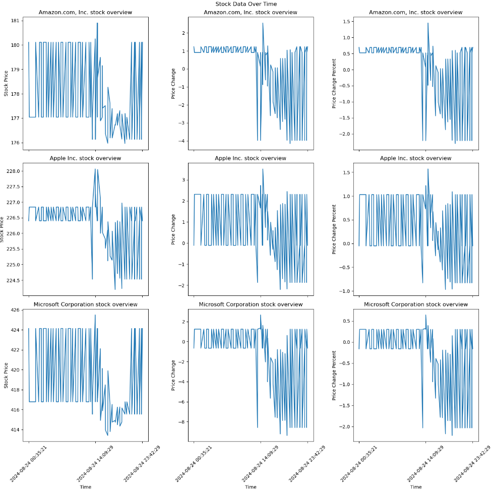

# Web Scraping Tool

## Introduction

This repository contains a Python tool designed for collecting, storing, and visualizing stock data from Yahoo Finance. This project integrates web scraping techniques, efficient data storage using the HDF5 format, and data visualization. Automation of the scraping process is achieved through GitHub Actions and Windows Task Scheduler.

## Features

- **Web Scraping**: Extracts stock data such as price, price change, and percentage change from Yahoo Finance.
- **Data Storage**: Utilizes HDF5 format for efficient storage and retrieval of large datasets.
- **Visualization**: Provides data visualizations using Matplotlib and Seaborn to analyze stock trends.
- **Automation**: Implements GitHub Actions and Windows Task Scheduler for scheduled data collection.

## Table of Contents

1. [Overview](#Overview)
2. [Python Script](#python-script)
3. [Data Storage in HDF5 Format](#data-storage-in-hdf5-format)
4. [Visualization](#Visualization)
5. [Repository Structure](#repository-structure)
6. [Getting Started](#getting-started)

## Overview

This project involves scraping stock data from Yahoo Finance pages, processing the information, and visualizing it to discern trends and patterns.

### Objectives

- Develop a web scraping script to extract stock data.
- Store the data in an HDF5 format for efficient access.
- Create visualizations to analyze trends in stock data.
- Automate the scraping process using GitHub Actions and Windows Task Scheduler.

## Python Script

### Overview of the Scraping Process

The `scraper.py` script is designed to scrape stock data from Yahoo Finance pages.

### Detailed Explanation of the `scraper.py` Script

- **Scraping Methodology**: Utilizes BeautifulSoup to parse HTML and extract stock data.
- **Extraction of Numeric Information**: Converts scraped data into numeric format for accurate analysis.
- **Handling Errors and Missing Data**: Implements error handling to manage issues during scraping.

### Automating the Scraping Process

#### Using GitHub Actions

The `auto_scrap.yml` file configures GitHub Actions to automate the scraping task at regular intervals.

#### Alternative Automation Method: Windows Task Scheduler

A batch file (`scraping.bat`) is provided to schedule scraping tasks on Windows systems.

## Data Storage in HDF5 Format

### Rationale for Using HDF5

HDF5 is chosen for its capability to efficiently handle large datasets, providing fast access and storage capabilities.

### Data Model Design

- **Structure of the HDF5 File**: Organizes data by date and company, with each dataset containing metadata and attributes.
- **Metadata and Attributes**: Stores additional information about the data for context and retrieval.
- **Storing Time Series Data**: Efficiently manages and retrieves time series data for analysis.

## Visualization

The `visualization.ipynb` notebook offers visual insights into the stock data, generating plots for stock prices, price changes, and percentage changes using Matplotlib and Seaborn. The visualizations include:

1. **Daily Stock Price Visualization**  
   

2. **Hourly Stock Price Visualization**  
   

### Interpretation of the Visualizations
1-Daily Visualizations:
- Consistent Patterns Across Companies: The visualizations for the daily data on short periods show that the three companies exhibit similar trends over time. This could indicate that the companies are reacting to broader market forces in a similar manner. For example, a general upward trend might suggest positive market conditions affecting all three companies, while synchronized drops might point to external factors impacting the entire sector.
- Smooth Temporal Changes: The daily data often shows smoother trends, with gradual changes rather than abrupt fluctuations. This could be due to the aggregation of data over a full day, which tends to average out short-term noise and highlights more significant movements. 

2-Hourly Visualizations:
- Variation in Intra-Day Patterns: Unlike the daily visualizations on short periods, the hourly data reveals more distinct patterns for each company. This suggests that while the companies may follow similar daily trends, their intra-day price movements can differ due to factors like company-specific news, trading volumes, or other microeconomic events.
- More Volatile Changes: The hourly plots often display more volatility, with sharp increases or decreases in stock prices within short time frames. This reflects the dynamic nature of stock prices during trading hours, where prices can react rapidly to new information or market sentiment.

3-Conclusion:
- The daily visualizations provide a broad overview of how the companies' stocks perform over time, showing similar trends across companies.
- The hourly visualizations, however, reveal the uniqueness in how each company's stock behaves within a day, capturing the more nuanced and immediate reactions to market events.

These insights demonstrate the importance of visualizing data at different temporal resolutions, as daily and hourly views can offer complementary perspectives on stock performance. The daily data helps to identify overall trends, while the hourly data provides a closer look at the company's behavior within those trends.

## Repository Structure

- **.github/workflows**: Contains the `auto_scrap.yml` file for automating the scraping process using GitHub Actions.
- **Images**: Contains images from the `visualization.ipynb` notebook, such as daily and hourly stock price visualizations.
- **URLs**: Includes the `URLs.ipynb` notebook to store the URLs in a CSV file.
- **scraped_data**: Contains the HDF5 file with scraped data from Yahoo Finance, organized by date and company.
- **.gitattributes**: Defines attributes for the repository.
- **.gitignore**: Specifies files and directories to be ignored by version control.
- **read_hdf5_file.py**: Script for reading data stored in HDF5 format.
- **requirements.txt**: Lists the dependencies required for the project.
- **scraper.py**: Main script for scraping stock data from Yahoo Finance.
- **scraping.bat**: Batch file for automating the scraping process on Windows systems using Task Scheduler.
- **visualization.ipynb**: Jupyter Notebook for visualizing the scraped stock data.

## Getting Started

### Prerequisites

- Python 3.x (The project was developed using Python 3.11).
- Required libraries listed in `requirements.txt`.

### Installation

1. Clone the repository: `https://github.com/TouradBaba/web_scraping.git`
2. Install dependencies: `pip install -r requirements.txt`
3. Navigate to the repository directory: `cd <repo_directory>`
